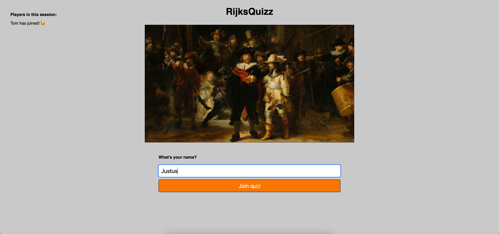
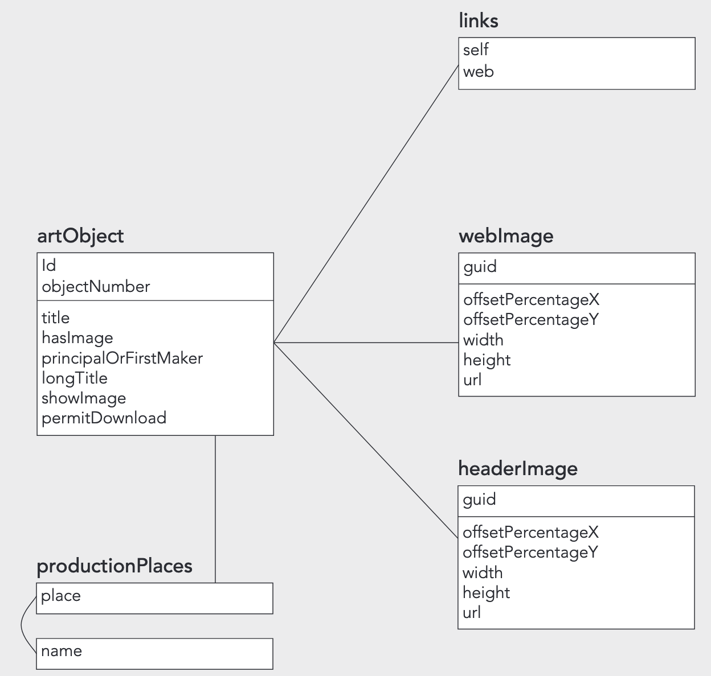
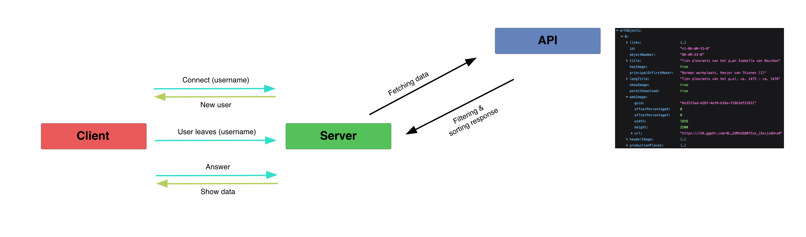

# Real-Time Web: RijksQuizz
RijksQuizz is een applicatie waarbij meerdere gebruikers kunnen gokken naar de schilder bij het schilderij. De schilderijen worden random ingeladen. 

De website is [hier](https://lekker-chatten.herokuapp.com/ "RijksDigital") te zien.



## Inhoudsopgave
- 

## Ideeën 💡
1. Een applicatie met de Spotify app waarbij de gebruikers samen kunnen luisteren naar hetzelfde lied.
2. Een quiz met meerdere gebruikers met vragen over voetbal.
3. Een quiz met schilderijen van het Rijksmuseum waarbij de gebruikers verschillende schilderijen te zien krijgen en kunnen gokken welke schilder er is.

## Installeren ⚙️

#### Cloning

Om de app lokaal te laten draaien moet het project eerst lokaal worden gecloned.
Als dit stukje code gerunt wordt in de terminal wordt de repository lokaal gecloned:

`gh repo clone tomvandenberg11/real-time-web-2122`

Ga eerst naar de folder waarin je wilt dat het project gecloned wordt. Je kan in de terminal navigeren met `cd` met daar achter de map waar je heen wilt.

Daarna is het nodig om `node` en `npm` geïnstalleerd te hebben op je lokale computer. Als je deze stappen gevolgd hebt, worden met `npm install` de benodigde packages gedownload.

#### Running

Als je de boven staande stappen gevolgd hebt kan de app opgestart worden door:

`npm run server`

te runnen in de terminal.
Je ziet dan een bericht in de terminal staan op welke link de app te zien is.

## Gebruik 💪🏼
Het spel kan gespeeld worden met meerdere gebruikers. De gebruiker kan dit spel spelen met een eigen gekozen username. Vervolgens kan de speler gokken door te typen in het invoerveld. Vervolgens krijgt de gebruiker een melding van een fout of goed antwoord.

Alle gebruikers krijgen een melding als er een speler connect of disconnect.

## API 💿
Voor dit project heb ik de API van het Rijksmuseum gebruikt. De API is vrij te gebruiken en bevat zo goed als alle
schilderijen in het Rijksmuseum. Meer informatie over deze API vind je [hier](https://data.rijksmuseum.nl/object-metadata/api/).

Er is wel een key nodig om de API te gebruiken. Deze kan verkregen worden door een account aan te maken bij Rijksmuseum Studio. Daarna is de key te vinden in instellingen.

De API wordt gebruikt doordat de schilderijen en kunstenaars opgeslagen en laten zien worden. 

#### API datamodel


## Real time events ⏩

#### Connection
Dit event wordt uitgevoerd wanneer er een nieuwe speler verbind met de quiz. Nu wordt er een connectie gemaakt met de socket.

#### User connected
Dit event wordt uitgevoerd wanneer er een nieuwe speler verbind met de quiz. Hiermee wordt zijn/haar naam in de array toegevoegd, waarna de naam voor elke speler te zien is.

#### User disconnect
Dit event wordt uitgevoerd wanneer er een speler de verbinding met de quiz verbreekt. De naam wordt dan uit de array gehaald zodat deze niet meer te zien is voor de andere spelers.

#### Show data
Dit event wordt uitgevoerd wanneer er op de 'Start' knop gedrukt wordt. Als dit event wordt uitgevoerd, wordt de data, dus het schilderij, getoond voor de desbetreffende speler.

#### Guessing
Dit event wordt uitgevoerd wanneer er een speler gokt op het schilderij. Vervolgens wordt er gecheckt of de gok van de speler goed is. Als dit het geval is krijgen alle spelers een bericht te zien dat de schilder geraden is.

## Data management
Data wordt op dit moment server-side opgeslagen in een array. Dit gebeurd op dit moment alleen voor de actieve spelers. Elke keer als er een speler connect wordt de naam opgeslagen in een array. Als de desbetreffende speler weer disconnect wordt de naam verwijdert uit de array.


## Data life cycle ♽


## Wishlist 🧞‍♂️

**M**ust haves
- Gebruikers kunnen eigen gebruikersnaam opgegeven ✅
- API verbinden met Socket.io ✅
- Bij alle gebruikers hetzelfde schilderij laten zien ✅
- Alle gebruikers op het scherm tonen ✅
- Opmaak ✅
- Melding goede antwoord ✅
- Responsiveness ✅
- Cleaning code ✅

**C**ould haves
- Alle gebruikers kunnen zien of er een nieuwe speler bij komt ✅
- Alle gebruikers kunnen zien of er een nieuwe speler weggaat ✅
- Data management ✅
- Zorgen dat het antwoord in lowercase gecontroleerd wordt ✅
- Naar het volgende schilderij gaan bij een goed antwoord
- Melding voor foute antwoord 
- UI stack toevoegen
- Mooiere alert voor goed geraden schilderij

**S**hould haves
- Punten voor goed antwoord

**W**ould haves
- Firebase implementeren voor scorebord

## Packages 📦
#### Express
Express is een `node.js` framework waarbij de applicatie server-side gedraaid kan worden. 

Express kan geïnstalleerd worden met het volgende command:

`npm install express`

Vervolgens moet de package required worden in `app.js`: 

```javascript
const express = require('express')
const app = express()

app.use(express.static(path.resolve('public')))
```

#### Path
Path wordt in dit project gebruikt om het pad aan te geven naar de public bestanden (HTML, CSS, client-side JavaScript, images) die gebruikt worden.

`npm install path`

```javascript
const path = require('path')
app.use(express.static(path.resolve('public')))
```

#### Socket.io
Socket.io wordt gebruikt om een socket te creëren voor de applicatie. Hiermee is het mogelijk om real-time events uit te voeren in de applicatie. 

`npm install socket.io`

```javascript
const io = require('socket.io')(http)

io.on('connection', (socket) => {
  // Real time events here
})
```

#### Nodemon
Nodemon wordt gebruikt om het coderen van Node.js apps makkelijker te maken. Het zorgt er namelijk voor dat de applicatie niet elke keer opnieuw opgestart hoeft te worden na veranderingen aan de server-side. Ook worden errors er door Nodemon uitgehaald.

`npm install nodemon`

In de package.json is het dan nodig om een script te maken met nodemon:

```json
"scripts": {
    "test": "echo \"Error: no test specified\" && exit 1",
    "start": "node app.js",
    "dev": "nodemon app.js"
}
```

#### Dotenv
Dotenv wordt gebruikt om `.env` bestanden te lezen. In de .env bestanden staat gevoelige data, zoals wachtwoorden of keys. Deze data wordt dan niet geüpload naar bijvoorbeeld GitHub.

`npm install dotenv`

```javascript
require('dotenv').config({path: '.env-dev'})

const {
  API_KEY
} = process.env
```

#### Node-fetch
Node-fetch wordt gebruikt om de data server-side van de API op te halen.

`npm install node-fetch`


## Licence 👨🏻‍⚖️

Dit project is voorzien van een MIT licence. Zie de pagina LICENCE voor meer informatie.

## Credits 📣

Ik wil graag als eerste de docenten bedanken voor al hun inzet, uitleg en lesstof. Ten tweede wil ik mijn supportgroepje bedanken voor de mentale en functionele support. Ten derde wil ik Stackoverflow bedanken voor al hun antwoorden op mijn vragen.